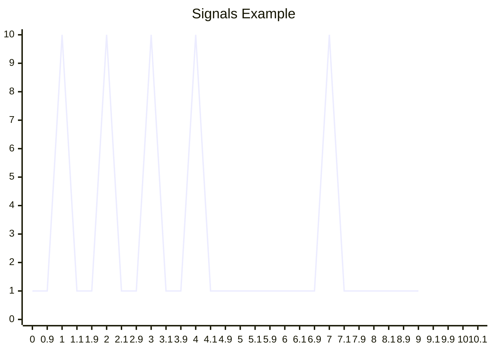

# Signal Neural Network (SNN)

This is based around an idea I have, no idea if it already exists. but I did found the neural coding wiki article.

Our neural networks talks with signals, not numbers.
They seem to send certain signals in rhythmic patterns. They seem to combine and process these signals and output new signals.



In theory we could simplfy these signals into a binary representation, whereby the peak of the signal is a 1 and the trough is a 0.
so we could represent the above signal as:

```
111100100
```

Now most signals in our brain are more complex than this, since strength of the signal is not the only thing that matters, but also the timing. And we can also represent so much with just a binary representation. This is also just a speculation on how it really works, but I want to try it out and see if it works.

[Read more about neural coding and signal neural network](./docs/snn.md)