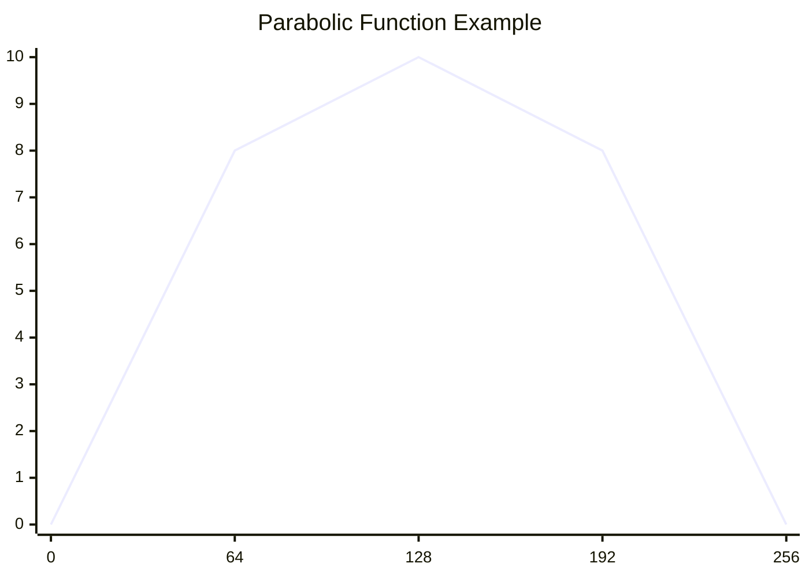

# Neural Coding 

- [Neural Coding](#neural-coding)
  - [Mapped Transformation](#mapped-transformation)
    - [Operations Emulation](#operations-emulation)
      - [Data Recognition](#data-recognition)
      - [If Statement Emulation](#if-statement-emulation)
      - [Switch Statement Emulation](#switch-statement-emulation)
      - [Mathematical Operations](#mathematical-operations)


## Mapped Transformation

we can define a struct that either uses a map or array to map from A to B.

For this example we will use a fixed sized array, but we can also use a hashmap or a vector.

```rust
pub struct MapNode {
    pub map: [u8; 256], // Assuming we map 8-bit signals to 8-bit outputs
}
```

This is a struct that can take a input signal, be used as an index to the data slice and return the mapped value. This allows for quick lookups and transformations based on predefined mappings.

```rust
impl MapNode {
    pub fn new(map: [u8; 256]) -> Self {
        MapNode { map }
    }

    pub fn process(&self, input: u8) -> u8 {
        self.map[input as usize]
    }
}
```

### Operations Emulation

With these kinds of nodes, you can emulate various operations, below defining some examples

#### Data Recognition

Lets take an example, We want a Node that can define if the input is a letter.

We assume the input is an asccii character, and we want to map all letters (A-Z, a-z) to 1 and all other characters to 0.
So we can define the data mapping something like this:

```yaml
data: # Ascii code mapping to 0 or 1
    - 0: 0
    - 1: 0
    - 2: 0
    - 3: 0
    - 4: 0
    - 5: 0
    - 6: 0
    - 7: 0
    - ...
    - 'a': 1
    - 'b': 1
    - 'c': 1
    - ...
    - 'A': 1
    - 'B': 1
    - 'C': 1
    - ...
```

Now we can make this more complex with a signal node, Now I create a node that can take a ascii character and tell us the following:

- If the character is a letter (A-Z, a-z)
- If the character is an uppercase letter (A-Z)
- If the character is a digit (0-9)
- If the character is a special character (e.g. !, @, #, etc.)
- If the character is a whitespace (e.g. space, tab, newline, etc.)
- If the character is a punctuation (e.g. ., ,, ;, :, etc.)

We can accomplish this using more complex outputs, where each bit represents a different property of the character. Or make it enum based, where by each property is a different value.

```yaml
data: # Ascii code mapping to properties
    - 0: 0b00000000 # Not a letter, not uppercase, not a digit, not a special character, not whitespace, not punctuation
    - 1: 0b00000000 # Not a letter, not uppercase, not a digit, not a special character, not whitespace, not punctuation
    - ...
    - 'a': 0b00000001 # Letter, lowercase
    - 'b': 0b00000001 # Letter, lowercase
    - 'c': 0b00000001 # Letter, lowercase
    - ...
    - 'A': 0b00000010 # Letter, uppercase
    - 'B': 0b00000010 # Letter, uppercase
    - 'C': 0b00000010 # Letter, uppercase
    - ...
    - '0': 0b00000100 # Digit
    - '1': 0b00000100 # Digit
    - '2': 0b00000100 # Digit
    - ...
    - '!': 0b00001000 # Special character
    - '@': 0b00001000 # Special character
    - '#': 0b00001000 # Special character
    - ...
    - ' ': 0b00010000 # Whitespace
    - '\t': 0b00010000 # Whitespace
    - '\n': 0b00010000 # Whitespace
```

Looking at this we can see that a single node can become very complex, and can be used to recognize various properties of the input data. This allows for a flexible and powerful way to process signals in a neural network.

#### If Statement Emulation

Like the Data Recognition example, we can also use the mapped transformation to emulate if statements. But now we just simply map the input to a boolean value. (1 or 0)

**Greater than 5 Example:**
```yaml
data: # Ascii code mapping to boolean values
    - 0: 0
    - 1: 0
    - 2: 0
    - 3: 0
    - 4: 0
    - 5: 0
    - 6: 1 # Greater than 5
    - 7: 1 # Greater than 5
    - 8: 1 # Greater than 5
    - 9: 1 # Greater than 5
    - ... : # All other values are 1
```

**Less than 5 Example:**
```yaml
data: # Ascii code mapping to boolean values
    - 0: 1 # Less than 5
    - 1: 1 # Less than 5
    - 2: 1 # Less than 5
    - 3: 1 # Less than 5
    - 4: 1 # Less than 5
    - 5: 0 # Not less than 5
    - 6: 0 # Not less than 5
    - 7: 0 # Not less than 5
    - ... : # All other values are 0
```

#### Switch Statement Emulation

We can also use the mapped transformation to emulate switch statements. This works pretty much like the Data Recognition example, but now we map the input to a specific output based on the value of the input.

#### Mathematical Operations

We can also use the mapped transformation to emulate mathematical operations. Though only based on constant values, or constants tranformations functions.

**Add 1 Example**
```yaml
data:
    - 0: 1 # 0 + 1 = 1
    - 1: 2
    - 2: 3
    - 3: 4
    - 4: 5
    - 5: 6
    - 6: 7
    - 7: 8
    - 8: 9
    - 9: 10
    - ... : # All other values are +1
```

**Multiply by 2 Example**
```yaml
data:
    - 0: 0 # 0 * 2 = 0
    - 1: 2 # 1 * 2 = 2
    - 2: 4 # 2 * 2 = 4
    - 3: 6 # 3 * 2 = 6
    - 4: 8 # 4 * 2 = 8
    - 5: 10 # 5 * 2 = 10
    - ... : # All other values are *2
```

**Transform function Example**

Lets assume a function that is parabolic, like `f(x) = x^2`, that goes up from 0 and goes down again at 255:



```yaml
data:
    - 0: 0 # f(0) = 0^2 = 0
    - 1: 1 # f(1) = 1^2 = 1
    - 2: 4 # f(2) = 2^2 = 4
    - 3: 9 # f(3) = 3^2 = 9
    - ... : # All other values are x^2
    - 255: 0 # f(255) = (255-128)^2 = 0
```

For most transformations you can notate the transformation like:

```yaml
data:
    - 0: f(0)
    - 1: f(1)
    - 2: f(2)
    - 3: f(3)
    - ... : # All other values are f(x)
```

Where `f(x)` is the transformation function you want to apply to the input value.